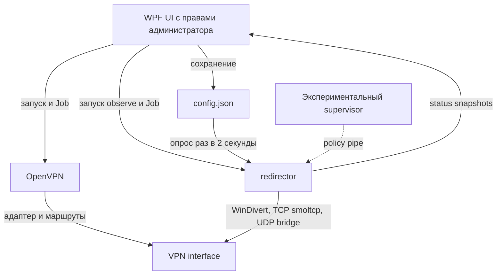

# Ревью OpenVPN Split Tunneling Client

Дата: 26 сентября 2026. Проверенный commit: `5f6273d22d29233699175935b5b3516c84383100`.

Проверено 62 отслеживаемых файла: 22 Rust-файла, 13 C#-файлов, XAML, protobuf, конфигурация сборки, installer, документация и комплект WinDivert. Рассмотрены также экспериментальные supervisor и Rust ui. Ссылки на код закреплены на проверенном commit, чтобы номера строк не менялись вместе с дальнейшими исправлениями.

Выявлено **42 замечания к активному продукту и его поставке: 16 P1, 24 P2, 2 P3**, плюс 3 замечания к экспериментальному supervisor. Приоритетный план и критерии закрытия находятся в [TODO.md](TODO.md).

Главный вывод: перед расширением функциональности нужно исправить надёжность TCP-моста, жизненный цикл процессов/политик, подготовку маршрутов, управление VPN-сессией и чистую установку. Текущую ревизию нельзя считать проверенной основой для обещаний о целостности потоков и изоляции трафика приложений.

## Метод и границы проверки

Это обзор исходников и контрактов компонентов с ограниченными безопасными проверками, а не пройденный сетевой acceptance test. Подтверждённые по коду условия отказа отделены от гипотез и будущих возможностей. P0 не присвоен: безусловной катастрофической ошибки для всех запусков не установлено.

- **P1:** исправить до следующего стабильного релиза: целостность данных, изоляция/владение ресурсами, существенные отказы основных сценариев.
- **P2:** подтверждённые ошибки отдельных сценариев, надёжность и недостающие проверки.
- **P3:** метаданные, отображение, согласованность документации.

Что выполнено:

| Проверка | Результат |
| --- | --- |
| Статический обзор Rust/C#/IPC/installer | Разделён между независимыми обзорами ядра, WPF и IPC; находки сверены с вызывающим кодом |
| PowerShell parser для installer/build.ps1 | 0 синтаксических ошибок; скрипт установки не исполнялся |
| XML parsing четырёх XAML, csproj и manifest | Все 6 файлов синтаксически корректны; это не WPF compile |
| dotnet build --no-restore | Не стартовал: No .NET SDKs were found |
| Rust/cargo | Не найдены в PATH; стандартный пользовательский каталог toolchain отсутствует; build/test/clippy не выполнены |
| Inno Setup | Не найден в проверенных стандартных каталогах; setup не собран |
| Точечные проверки .NET/Win32 в памяти | Подтверждены исключение LINQ для дубликатов, overflow uptime и ошибочный parsing аргумента supervisor; UI и дочерние процессы не запускались |
| Проверка официального MSI OpenVPN | Скачан пакет, прочитаны metadata/Feature table через Windows Installer COM в read-only режиме; подпись валидна |
| WinDivert из vendor | VERSION = 2.2.2; подпись WinDivert64.sys валидна; DLL не подписана. Это не само по себе находка о вредоносности |
| Автотесты в репозитории | Найдены 2 roundtrip-теста в ipc/src/lib.rs; отдельных .NET/test проектов и CI workflows нет |

VPN, драйверы, маршруты, службы и чужие процессы в ходе проверки не запускались и не менялись. Сборка, нагрузочные сетевые тесты, реальная проверка межпользовательских ACL/MIC, совместимость с anti-cheat и аудит зависимостей по базам уязвимостей не выполнены. Отсутствие этих проверок не означает, что они пройдены. Изменения этой задачи — только REVIEW.md и TODO.md.

## Фактическая архитектура

WPF не отправляет policy-команды: список EXE читается backend из общего JSON. Однако policy pipe включён в production observe. В status.proto объявлены Event/Command, но сервер сейчас посылает только Snapshot. Rust ui является заглушкой. Наличие supervisor в workspace не обеспечивает наследование дочерних процессов в обычном WPF-сценарии.

## Индекс замечаний

| ID | Приоритет | Область | Замечание |
| --- | --- | --- | --- |
| [CORE-01](#core-01) | P1 | Сетевое ядро | Потеря данных TCP при заполнении очереди upload |
| [CORE-02](#core-02) | P1 | Сетевое ядро | Потеря остатка блока TCP при download |
| [CORE-03](#core-03) | P1 | Сетевое ядро | Half-close приложения не доходит до удалённого TCP-сервера |
| [CORE-04](#core-04) | P1 | Сетевое ядро | Удаление приложения и завершение PID не отзывают policy |
| [CORE-05](#core-05) | P1 | Сетевое ядро | Resolver навсегда кеширует путь по числовому PID |
| [CORE-06](#core-06) | P1 | Сетевое ядро | Повторное использование UDP-порта наследует старого владельца |
| [CORE-07](#core-07) | P1 | Сетевое ядро | UDP idle timeout оставляет фоновые задачи и сокеты |
| [CORE-08](#core-08) | P1 | Сетевое ядро | VPN объявляется готовым до готовности маршрутизации |
| [CORE-09](#core-09) | P1 | Сетевое ядро | Cleanup может удалить маршрут, созданный другим ПО |
| [CORE-10](#core-10) | P1 | Сетевое ядро | Ошибка фонового компонента не обеспечивает остановку redirector |
| [UI-01](#ui-01) | P1 | UI и управление VPN | Запуск, установка и удаление клиента завершают чужие VPN-процессы |
| [UI-02](#ui-02) | P1 | UI и управление VPN | Повторные Connect создают несколько неуправляемых сессий |
| [UI-03](#ui-03) | P1 | UI и управление VPN | Профиль может превратить подключение в VPN для всей системы |
| [SEC-01](#sec-01) | P1 | Безопасность и IPC | Расшифрованный пароль остаётся на диске после сессии |
| [SEC-03](#sec-03) | P1 | Безопасность и IPC | Policy endpoint не авторизует владельца правил/PID |
| [BUILD-01](#build-01) | P1 | Установка и сборка | Installer запрашивает отсутствующий компонент OpenVPN MSI |
| [CORE-11](#core-11) | P2 | Сетевое ядро | Смена VPN без промежуточного down оставляет старые bridges |
| [CORE-12](#core-12) | P2 | Сетевое ядро | TCP Pending flows не имеют корректной очистки |
| [CORE-13](#core-13) | P2 | Сетевое ядро | Ошибки чтения capture молча игнорируются |
| [CORE-14](#core-14) | P2 | Сетевое ядро | Пустая UDP datagram ошибочно завершает receive-задачу |
| [CORE-15](#core-15) | P2 | Сетевое ядро | Выбирается первый похожий VPN-адаптер, без связи с профилем |
| [UI-04](#ui-04) | P2 | UI и управление VPN | Повторное добавление одного EXE приводит к падению UI |
| [UI-05](#ui-05) | P2 | UI и управление VPN | Certificate-only профили блокируются обязательными credentials |
| [UI-06](#ui-06) | P2 | UI и управление VPN | Импорт теряет относительные зависимости OVPN |
| [UI-07](#ui-07) | P2 | UI и управление VPN | Server override сохраняется, но не используется |
| [UI-08](#ui-08) | P2 | UI и управление VPN | Неатомарная запись и молчаливый сброс повреждённой конфигурации |
| [UI-09](#ui-09) | P2 | UI и управление VPN | Ошибка Job assignment оставляет ребёнка без контроля |
| [UI-10](#ui-10) | P2 | UI и управление VPN | Dev-запуск привязан к чужому абсолютному пути |
| [UI-11](#ui-11) | P2 | UI и управление VPN | Ошибки OpenVPN и потеря redirector оставляют неверное состояние кнопок |
| [SEC-02](#sec-02) | P2 | Безопасность и IPC | Management-интерфейс OpenVPN не требует аутентификации |
| [SEC-04](#sec-04) | P2 | Безопасность и IPC | UI доверяет любому серверу с фиксированным именем status pipe |
| [SEC-05](#sec-05) | P2 | Безопасность и IPC | Семантически некорректный Snapshot способен уронить UI |
| [SEC-06](#sec-06) | P2 | Безопасность и IPC | Нет общего лимита IPC-клиентов и deadline обмена |
| [BUILD-02](#build-02) | P2 | Установка и сборка | Installer допускает неподходящую архитектуру и режим установки |
| [BUILD-03](#build-03) | P2 | Установка и сборка | Загрузка MSI и кеш не проверяются на целостность |
| [BUILD-04](#build-04) | P2 | Установка и сборка | Сборка «из любой папки» теряет конфигурацию Cargo проекта |
| [BUILD-05](#build-05) | P2 | Установка и сборка | Обновлённые WinDivert DLL/SYS не заменяют старые build-артефакты |
| [BUILD-06](#build-06) | P2 | Установка и сборка | Заявленный Rust 1.75+ не соответствует зависимостям |
| [DOC-01](#doc-01) | P2 | Соответствие обещаний реализации | Туннелирование дочерних процессов обещано, но не реализовано в WPF-пути |
| [DOC-02](#doc-02) | P2 | Соответствие обещаний реализации | Гарантия отсутствия DNS-утечек не обеспечена архитектурой |
| [UI-12](#ui-12) | P3 | UI и управление VPN | Парсер remote и миграция повреждают отображаемый адрес |
| [DOC-03](#doc-03) | P3 | Соответствие обещаний реализации | Документация, версии и метаданные расходятся с поставкой |

## P1

### CORE-01

**P1 · Потеря данных TCP при заполнении очереди upload**

Место: [redirector/src/divert.rs:524](https://github.com/bigpillowguy/OpenVPN-Split-Tunneling/blob/5f6273d22d29233699175935b5b3516c84383100/redirector/src/divert.rs#L524); [redirector/src/divert.rs:532](https://github.com/bigpillowguy/OpenVPN-Split-Tunneling/blob/5f6273d22d29233699175935b5b3516c84383100/redirector/src/divert.rs#L532).

Данные сначала удаляются из receive-буфера smoltcp через recv_slice, затем передаются в канал из 64 элементов. Если try_send возвращает Full, извлечённый блок уничтожается. При медленном сервере/VPN или долгом connect приложение уже считает эти байты принятыми TCP; повторной передачи потерянного содержимого не будет.

Исправление: Резервировать ёмкость перед чтением либо сохранять pending-buffer; при заполнении очереди применять обратное давление без удаления байтов.

Критерий проверки: Передача большого случайного файла медленному получателю с малыми очередями завершается с совпадающим SHA-256.

### CORE-02

**P1 · Потеря остатка блока TCP при download**

Место: [redirector/src/divert.rs:554](https://github.com/bigpillowguy/OpenVPN-Split-Tunneling/blob/5f6273d22d29233699175935b5b3516c84383100/redirector/src/divert.rs#L554).

can_send означает наличие некоторого свободного места. После частичного send_slice следующий Ok(0) прерывает цикл, и оставшийся хвост data исчезает. Например, при 1 KiB свободного места и блоке 16 KiB могут потеряться 15 KiB.

Исправление: Хранить блок и позицию записи между итерациями до полной передачи в smoltcp.

Критерий проверки: Медленно читающий клиент получает файл целиком при произвольных частичных записях и заполнении TX-буфера.

### CORE-03

**P1 · Half-close приложения не доходит до удалённого TCP-сервера**

Место: [redirector/src/divert.rs:540](https://github.com/bigpillowguy/OpenVPN-Split-Tunneling/blob/5f6273d22d29233699175935b5b3516c84383100/redirector/src/divert.rs#L540); [redirector/src/divert.rs:628](https://github.com/bigpillowguy/OpenVPN-Split-Tunneling/blob/5f6273d22d29233699175935b5b3516c84383100/redirector/src/divert.rs#L628).

Получение FIN только устанавливает app_half_closed. Канал app_to_remote остаётся открыт, а wr.shutdown вызывается лишь после завершения чтения канала. Сервер, который отвечает после EOF запроса, может ждать бесконечно.

Исправление: Передавать EOF после всех накопленных байтов и независимо поддерживать обратное направление соединения.

Критерий проверки: Клиент делает shutdown(Send), сервер видит EOF и успешно возвращает ответ; проверены оба порядка FIN и RST.

### CORE-04

**P1 · Удаление приложения и завершение PID не отзывают policy**

Место: [redirector/src/proc_watcher.rs:49](https://github.com/bigpillowguy/OpenVPN-Split-Tunneling/blob/5f6273d22d29233699175935b5b3516c84383100/redirector/src/proc_watcher.rs#L49); [redirector/src/proc_watcher.rs:67](https://github.com/bigpillowguy/OpenVPN-Split-Tunneling/blob/5f6273d22d29233699175935b5b3516c84383100/redirector/src/proc_watcher.rs#L67); [redirector/src/divert.rs:272](https://github.com/bigpillowguy/OpenVPN-Split-Tunneling/blob/5f6273d22d29233699175935b5b3516c84383100/redirector/src/divert.rs#L272).

Watcher пропускает ранее допущенные PID, а при завершении процесса очищает вспомогательные карты, но не PolicyState. Удалённое из настроек работающее приложение продолжает туннелироваться. Повторное использование PID может передать его разрешение постороннему процессу. Допущенные прямо при обработке пакета PID также требуют очистки.

Исправление: Согласовывать актуальную policy с конфигурацией и идентичностью живых процессов; определить поведение уже открытых flows при отзыве.

Критерий проверки: Удаление EXE меняет обработку новых соединений в оговорённый срок; новый процесс с повторно использованным PID не наследует разрешение.

### CORE-05

**P1 · Resolver навсегда кеширует путь по числовому PID**

Место: [redirector/src/process.rs:27](https://github.com/bigpillowguy/OpenVPN-Split-Tunneling/blob/5f6273d22d29233699175935b5b3516c84383100/redirector/src/process.rs#L27).

Кеш сохраняет положительные и отрицательные результаты без срока жизни. После PID reuse путь относится к прежнему процессу; это независимо от CORE-04 может неверно допустить приложение либо выпустить первые пакеты выбранного приложения напрямую.

Исправление: Использовать PID вместе со временем создания/дескриптором процесса, удалять завершённые записи и ограничить отрицательный кеш.

Критерий проверки: Последовательно созданные разные процессы с одним PID определяются правильно; временная ошибка resolve не становится постоянной.

### CORE-06

**P1 · Повторное использование UDP-порта наследует старого владельца**

Место: [redirector/src/divert.rs:255](https://github.com/bigpillowguy/OpenVPN-Split-Tunneling/blob/5f6273d22d29233699175935b5b3516c84383100/redirector/src/divert.rs#L255); [redirector/src/observer.rs:49](https://github.com/bigpillowguy/OpenVPN-Split-Tunneling/blob/5f6273d22d29233699175935b5b3516c84383100/redirector/src/observer.rs#L49); [redirector/src/flows.rs:49](https://github.com/bigpillowguy/OpenVPN-Split-Tunneling/blob/5f6273d22d29233699175935b5b3516c84383100/redirector/src/flows.rs#L49).

Для wildcard BIND 0.0.0.0:P после первого пакета дополнительно кешируется LAN_IP:P. CLOSE удаляет только исходный ключ. При новом BIND другого процесса lookup предпочитает оставшийся exact-кеш свежей wildcard-записи и выбирает неправильный PID.

Исправление: Связать aliases с идентичностью сокета/flow и удалять их вместе; актуальный BIND должен инвалидировать старые производные записи.

Критерий проверки: Два приложения с разными правилами последовательно используют один wildcard UDP-порт и каждый раз получают правильный маршрут.

### CORE-07

**P1 · UDP idle timeout оставляет фоновые задачи и сокеты**

Место: [redirector/src/divert.rs:503](https://github.com/bigpillowguy/OpenVPN-Split-Tunneling/blob/5f6273d22d29233699175935b5b3516c84383100/redirector/src/divert.rs#L503); [redirector/src/divert.rs:675](https://github.com/bigpillowguy/OpenVPN-Split-Tunneling/blob/5f6273d22d29233699175935b5b3516c84383100/redirector/src/divert.rs#L675).

Удаление UdpFlow закрывает канал отправки, но отдельная receive-задача продолжает ждать recv на собственном Arc<UdpSocket>. join! ждёт обе задачи. Для молчащего peer остаются сокет, буфер 64 KiB и задачи; аналогично при VPN down.

Исправление: Ввести явную отмену bridge и завершать обе задачи с освобождением сокета при timeout, ошибке и смене VPN.

Критерий проверки: После тысяч UDP flows без ответа и истечения timeout число задач/handles и потребление памяти возвращаются к исходному уровню.

### CORE-08

**P1 · VPN объявляется готовым до готовности маршрутизации**

Место: [redirector/src/vpn_state.rs:34](https://github.com/bigpillowguy/OpenVPN-Split-Tunneling/blob/5f6273d22d29233699175935b5b3516c84383100/redirector/src/vpn_state.rs#L34); [redirector/src/vpn_state.rs:72](https://github.com/bigpillowguy/OpenVPN-Split-Tunneling/blob/5f6273d22d29233699175935b5b3516c84383100/redirector/src/vpn_state.rs#L72); [redirector/src/vpn_state.rs:124](https://github.com/bigpillowguy/OpenVPN-Split-Tunneling/blob/5f6273d22d29233699175935b5b3516c84383100/redirector/src/vpn_state.rs#L124).

Отсутствие найденного gateway или ошибка route ADD не мешают публикации Some(target). Повторной попытки нет, пока не изменятся IP/index. Адрес может появиться раньше маршрутов OpenVPN; поиск gateway только по routed /32 также пропускает другие топологии. UI показывает подключение, а bridge не имеет рабочего next-hop.

Исправление: Разделить обнаружение адаптера и готовность маршрута; проверять результаты, повторять настройку и получать gateway из надёжного структурированного источника.

Критерий проверки: Позднее появление gateway и первая неудачная ADD восстанавливаются автоматически; до готовности маршрут не показывается рабочим.

### CORE-09

**P1 · Cleanup может удалить маршрут, созданный другим ПО**

Место: [redirector/src/vpn_state.rs:88](https://github.com/bigpillowguy/OpenVPN-Split-Tunneling/blob/5f6273d22d29233699175935b5b3516c84383100/redirector/src/vpn_state.rs#L88); [redirector/src/vpn_state.rs:98](https://github.com/bigpillowguy/OpenVPN-Split-Tunneling/blob/5f6273d22d29233699175935b5b3516c84383100/redirector/src/vpn_state.rs#L98).

Даже после неудачной route ADD сохраняется Some(gateway). Позже выполняется DELETE по префиксу и gateway без интерфейса и проверки владения. Если ADD отказала из-за существующего маршрута, cleanup может удалить чужую запись. Высокая метрика добавляемого default route также не означает отсутствие системных изменений.

Исправление: Запоминать только успешно созданный собственный маршрут и удалять точную запись по интерфейсу, префиксу и next-hop; предусмотреть cleanup при штатном shutdown.

Критерий проверки: Заранее существующий маршрут переживает connect/disconnect и ошибку ADD; созданный клиентом удаляется без затрагивания остальных.

### CORE-10

**P1 · Ошибка фонового компонента не обеспечивает остановку redirector**

Место: [redirector/src/main.rs:68](https://github.com/bigpillowguy/OpenVPN-Split-Tunneling/blob/5f6273d22d29233699175935b5b3516c84383100/redirector/src/main.rs#L68); [redirector/src/main.rs:82](https://github.com/bigpillowguy/OpenVPN-Split-Tunneling/blob/5f6273d22d29233699175935b5b3516c84383100/redirector/src/main.rs#L82); [redirector/src/observer.rs:25](https://github.com/bigpillowguy/OpenVPN-Split-Tunneling/blob/5f6273d22d29233699175935b5b3516c84383100/redirector/src/observer.rs#L25).

select! выходит по первой ошибке, но observer и capture работают в бесконечных spawn_blocking без механизма отмены. Завершение runtime может ждать их бесконечно, оставляя capture активным при остановленных async-компонентах.

Исправление: Ввести общий shutdown: сигнал, пробуждение WinDivert recv, закрытие каналов, ожидание задач и освобождение собственных маршрутов.

Критерий проверки: Отказ policy/status-сервера или watcher при активном capture приводит к ограниченной по времени согласованной остановке.

Поведение начатых blocking-задач описано в [Tokio spawn_blocking](https://docs.rs/tokio/latest/tokio/task/fn.spawn_blocking.html).

### UI-01

**P1 · Запуск, установка и удаление клиента завершают чужие VPN-процессы**

Место: [dotnet/VpnClient.Ui/App.xaml.cs:17](https://github.com/bigpillowguy/OpenVPN-Split-Tunneling/blob/5f6273d22d29233699175935b5b3516c84383100/dotnet/VpnClient.Ui/App.xaml.cs#L17); [dotnet/VpnClient.Ui/Redirector.cs:27](https://github.com/bigpillowguy/OpenVPN-Split-Tunneling/blob/5f6273d22d29233699175935b5b3516c84383100/dotnet/VpnClient.Ui/Redirector.cs#L27); [installer/VpnClient.iss:85](https://github.com/bigpillowguy/OpenVPN-Split-Tunneling/blob/5f6273d22d29233699175935b5b3516c84383100/installer/VpnClient.iss#L85); [installer/VpnClient.iss:107](https://github.com/bigpillowguy/OpenVPN-Split-Tunneling/blob/5f6273d22d29233699175935b5b3516c84383100/installer/VpnClient.iss#L107).

UI вызывает KillOrphans для всех процессов с именами openvpn/redirector, без проверки владельца и принадлежности. Installer/uninstaller делают аналогичный taskkill и пытаются остановить/удалить WinDivert по общему имени. Запуск второго UI либо установка клиента обрывает независимые OpenVPN-подключения.

Исправление: Убрать завершение по общему имени; хранить владение дочерними процессами и добавить защиту от второго экземпляра. Не обслуживать чужой драйвер/службу как собственный ресурс.

Критерий проверки: Запуск, обновление, удаление и второй экземпляр клиента не завершают независимый OpenVPN и чужие процессы.

### UI-02

**P1 · Повторные Connect создают несколько неуправляемых сессий**

Место: [dotnet/VpnClient.Ui/VpnConnector.cs:38](https://github.com/bigpillowguy/OpenVPN-Split-Tunneling/blob/5f6273d22d29233699175935b5b3516c84383100/dotnet/VpnClient.Ui/VpnConnector.cs#L38); [dotnet/VpnClient.Ui/VpnConnector.cs:87](https://github.com/bigpillowguy/OpenVPN-Split-Tunneling/blob/5f6273d22d29233699175935b5b3516c84383100/dotnet/VpnClient.Ui/VpnConnector.cs#L87); [dotnet/VpnClient.Ui/VpnConfigWindow.xaml.cs:126](https://github.com/bigpillowguy/OpenVPN-Split-Tunneling/blob/5f6273d22d29233699175935b5b3516c84383100/dotnet/VpnClient.Ui/VpnConfigWindow.xaml.cs#L126); [dotnet/VpnClient.Ui/MainWindow.xaml.cs:230](https://github.com/bigpillowguy/OpenVPN-Split-Tunneling/blob/5f6273d22d29233699175935b5b3516c84383100/dotnet/VpnClient.Ui/MainWindow.xaml.cs#L230).

ConnectAsync не сериализован и перезаписывает _process/ManagementPort, не остановив старый OpenVPN. Кнопку профиля можно нажимать повторно; 30-секундный timeout главного окна разрешает retry без остановки предыдущей попытки. Disconnect управляет только последним процессом. Сессии также делят auth.txt и log.

Исправление: Единая модель состояний подключения с отменой, блокировкой параллельного старта и ожиданием остановки предыдущей сессии; отдельные ресурсы каждой попытки.

Критерий проверки: Двойной Connect, timeout→retry, смена профиля и одновременный Disconnect оставляют не более одного собственного OpenVPN.

### UI-03

**P1 · Профиль может превратить подключение в VPN для всей системы**

Место: [dotnet/VpnClient.Ui/VpnConnector.cs:69](https://github.com/bigpillowguy/OpenVPN-Split-Tunneling/blob/5f6273d22d29233699175935b5b3516c84383100/dotnet/VpnClient.Ui/VpnConnector.cs#L69).

Исходный .ovpn запускается без проверки локальных маршрутизирующих опций. Локальный redirect-gateway def1 сохраняется. Фильтр pushed redirect-gateway не отклоняет обычные pushed route, в том числе две записи /1, охватывающие IPv4. Невыбранные приложения тогда тоже меняют внешний маршрут.

Исправление: Определить и реализовать политику локальных и pushed маршрутов/DNS при подготовке runtime-профиля, сохранив необходимые маршруты самого туннеля.

Критерий проверки: Профили с локальным redirect-gateway и pushed /1 не меняют внешний IP невыбранного приложения; выбранное выходит через VPN.

Область действия pull-filter подтверждена [OpenVPN 2.7 manual](https://openvpn.net/community-docs/community-articles/openvpn-2-7-manual.html).

### SEC-01

**P1 · Расшифрованный пароль остаётся на диске после сессии**

Место: [dotnet/VpnClient.Ui/VpnConnector.cs:44](https://github.com/bigpillowguy/OpenVPN-Split-Tunneling/blob/5f6273d22d29233699175935b5b3516c84383100/dotnet/VpnClient.Ui/VpnConnector.cs#L44); [dotnet/VpnClient.Ui/VpnConnector.cs:118](https://github.com/bigpillowguy/OpenVPN-Split-Tunneling/blob/5f6273d22d29233699175935b5b3516c84383100/dotnet/VpnClient.Ui/VpnConnector.cs#L118).

Несмотря на DPAPI в config.json, ConnectAsync записывает логин и пароль в %LOCALAPPDATA%\VpnClient\runtime\auth.txt. Удаления нет при disconnect, ошибке, закрытии или удалении профиля. Постоянная незашифрованная копия подтверждена по коду; доступ других Windows-пользователей к файлу не проверялся.

Исправление: Использовать защищённую передачу credentials либо ограниченный сессионный файл с минимальным временем жизни и очисткой после crash.

Критерий проверки: После успеха, ошибки, disconnect и следующего запуска после crash не остаётся постоянного plaintext auth-файла; проверены ACL.

### SEC-03

**P1 · Policy endpoint не авторизует владельца правил/PID**

Место: [redirector/src/policy_server.rs:24](https://github.com/bigpillowguy/OpenVPN-Split-Tunneling/blob/5f6273d22d29233699175935b5b3516c84383100/redirector/src/policy_server.rs#L24); [redirector/src/policy_server.rs:109](https://github.com/bigpillowguy/OpenVPN-Split-Tunneling/blob/5f6273d22d29233699175935b5b3516c84383100/redirector/src/policy_server.rs#L109); [redirector/src/status_server.rs:70](https://github.com/bigpillowguy/OpenVPN-Split-Tunneling/blob/5f6273d22d29233699175935b5b3516c84383100/redirector/src/status_server.rs#L70); [redirector/src/divert.rs:272](https://github.com/bigpillowguy/OpenVPN-Split-Tunneling/blob/5f6273d22d29233699175935b5b3516c84383100/redirector/src/divert.rs#L272).

Оба pipe дают Authenticated Users full control. Любой допущенный клиент может добавить произвольный PID, который считается разрешённым до проверки EXE. Неиспользуемый WPF policy endpoint всё равно поднят. Подтверждена чрезмерная DACL и отсутствие авторизации; эксплуатация medium→high и обход Windows MIC не проверялись, RCE/повышение привилегий не заявляются.

Исправление: Отключить ненужный production policy endpoint либо ограничить доступ logon SID/служебной идентичностью, проверить клиента/владение policy; исключить право создания серверных экземпляров для клиентов.

Критерий проверки: Матрица пользователей и integrity levels допускает только предусмотренный клиент; посторонний PID нельзя добавить в policy.

Права pipe и отдельные ограничения MIC: [Microsoft IPC](https://learn.microsoft.com/en-us/windows/win32/ipc/named-pipe-security-and-access-rights), [Microsoft MIC](https://learn.microsoft.com/en-us/windows/win32/secauthz/mandatory-integrity-control).

### BUILD-01

**P1 · Installer запрашивает отсутствующий компонент OpenVPN MSI**

Место: [installer/VpnClient.iss:21](https://github.com/bigpillowguy/OpenVPN-Split-Tunneling/blob/5f6273d22d29233699175935b5b3516c84383100/installer/VpnClient.iss#L21); [installer/VpnClient.iss:74](https://github.com/bigpillowguy/OpenVPN-Split-Tunneling/blob/5f6273d22d29233699175935b5b3516c84383100/installer/VpnClient.iss#L74).

В ADDLOCAL указан Drivers.Wintun. В скачанном официальном OpenVPN-2.7.4-I001-amd64.msi с валидной подписью этого Feature нет; Drivers.TAPWindows6 и Drivers.OvpnDco присутствуют. Это несовместимая команда установки на чистой машине. Код также не проверяет результат MSI и наличие работоспособного OpenVPN перед успешным завершением setup. Полная установка в ходе ревью не выполнялась.

Исправление: Согласовать ADDLOCAL с Feature-таблицей выбранного MSI, проверить установку core binary/драйвера, обработать exit codes и необходимость перезагрузки.

Критерий проверки: Чистая поддерживаемая Windows получает OpenVPN и рабочий драйвер; сбой MSI останавливает setup с понятной диагностикой.

Отсутствующий Feature соответствует внутренней ошибке 2711 в [Windows Installer](https://learn.microsoft.com/en-us/windows/win32/msi/windows-installer-error-messages). Данные проверенного MSI приведены ниже.

## P2

### CORE-11

**P2 · Смена VPN без промежуточного down оставляет старые bridges**

Место: [redirector/src/divert.rs:127](https://github.com/bigpillowguy/OpenVPN-Split-Tunneling/blob/5f6273d22d29233699175935b5b3516c84383100/redirector/src/divert.rs#L127); [redirector/src/vpn_state.rs:48](https://github.com/bigpillowguy/OpenVPN-Split-Tunneling/blob/5f6273d22d29233699175935b5b3516c84383100/redirector/src/vpn_state.rs#L48).

Watcher поддерживает Some(old) → Some(new), но teardown flows выполняется только для Some → None. При смене IP/index между опросами существующие сокеты остаются привязаны к старому интерфейсу.

Исправление: Обрабатывать любое изменение VpnTarget с согласованным завершением или восстановлением flows.

Критерий проверки: Быстрая смена IP/index не оставляет живых bridges на старом target.

### CORE-12

**P2 · TCP Pending flows не имеют корректной очистки**

Место: [redirector/src/divert.rs:315](https://github.com/bigpillowguy/OpenVPN-Split-Tunneling/blob/5f6273d22d29233699175935b5b3516c84383100/redirector/src/divert.rs#L315); [redirector/src/divert.rs:427](https://github.com/bigpillowguy/OpenVPN-Split-Tunneling/blob/5f6273d22d29233699175935b5b3516c84383100/redirector/src/divert.rs#L427).

Listener с суммарно 128 KiB TCP-буферов создаётся для любого выбранного TCP-пакета, а Pending обрабатывает только переход в Established. Прерванный handshake, RST или захват уже существующего соединения могут оставить запись навсегда.

Исправление: Принимать подходящие новые SYN, ограничить число flows, задать timeout и обработать терминальные состояния до Established.

Критерий проверки: Отмена connect, RST до Established и включение VPN для открытого соединения не накапливают Pending flows.

### CORE-13

**P2 · Ошибки чтения capture молча игнорируются**

Место: [redirector/src/divert.rs:88](https://github.com/bigpillowguy/OpenVPN-Split-Tunneling/blob/5f6273d22d29233699175935b5b3516c84383100/redirector/src/divert.rs#L88).

Цикл обрабатывает только Ok(Some(packet)), не различая нормальное отсутствие пакета и постоянную ошибку драйвера. Возможны busy loop и неработающий redirector без отражения неисправности в UI.

Исправление: Разделить timeout и постоянные ошибки; передавать отказ координатору и публиковать состояние ошибки.

Критерий проверки: Инъекция постоянной ошибки recv не создаёт tight loop и приводит к диагностируемому shutdown/recovery.

### CORE-14

**P2 · Пустая UDP datagram ошибочно завершает receive-задачу**

Место: [redirector/src/divert.rs:690](https://github.com/bigpillowguy/OpenVPN-Split-Tunneling/blob/5f6273d22d29233699175935b5b3516c84383100/redirector/src/divert.rs#L690).

Ok(0) трактуется как EOF. У UDP нулевая длина является допустимой datagram; она теряется, а приём последующих ответов прекращается.

Исправление: Доставлять пустую datagram как сообщение, завершать receive только по ошибке или явной отмене.

Критерий проверки: Пустая datagram до и после обычной успешно проходит в обе стороны.

### CORE-15

**P2 · Выбирается первый похожий VPN-адаптер, без связи с профилем**

Место: [redirector/src/adapter.rs:30](https://github.com/bigpillowguy/OpenVPN-Split-Tunneling/blob/5f6273d22d29233699175935b5b3516c84383100/redirector/src/adapter.rs#L30); [redirector/src/adapter.rs:53](https://github.com/bigpillowguy/OpenVPN-Split-Tunneling/blob/5f6273d22d29233699175935b5b3516c84383100/redirector/src/adapter.rs#L53).

Имя/описание содержит wintun, tap-windows или openvpn, адаптер Up и имеет IPv4 — этого достаточно. При нескольких VPN программа может показать чужой туннель как свой и отправить выбранные приложения не через нужное подключение.

Исправление: Связать target с адаптером конкретной OpenVPN-сессии по GUID/index; неоднозначность показывать как ошибку.

Критерий проверки: При двух активных VPN выбор соответствует текущему профилю, а Disconnect управляет только собственной сессией.

### UI-04

**P2 · Повторное добавление одного EXE приводит к падению UI**

Место: [dotnet/VpnClient.Ui/SettingsWindow.xaml.cs:37](https://github.com/bigpillowguy/OpenVPN-Split-Tunneling/blob/5f6273d22d29233699175935b5b3516c84383100/dotnet/VpnClient.Ui/SettingsWindow.xaml.cs#L37); [dotnet/VpnClient.Ui/MainWindow.xaml.cs:263](https://github.com/bigpillowguy/OpenVPN-Split-Tunneling/blob/5f6273d22d29233699175935b5b3516c84383100/dotnet/VpnClient.Ui/MainWindow.xaml.cs#L263).

Settings допускает дубликаты путей. После добавления одного EXE дважды следующая операция обновления списка вызывает ToDictionary с повторяющимся ключом и необработанное исключение. Падение UI также завершает принадлежащий ему Job и VPN.

Исправление: Дедуплицировать нормализованные пути при добавлении/загрузке и безопасно восстанавливать уже повреждённый список.

Критерий проверки: Повторный путь, в том числе с другим регистром, не создаёт дубликат и не приводит к исключению при следующем изменении.

### UI-05

**P2 · Certificate-only профили блокируются обязательными credentials**

Место: [dotnet/VpnClient.Ui/MainWindow.xaml.cs:207](https://github.com/bigpillowguy/OpenVPN-Split-Tunneling/blob/5f6273d22d29233699175935b5b3516c84383100/dotnet/VpnClient.Ui/MainWindow.xaml.cs#L207); [dotnet/VpnClient.Ui/VpnConfigWindow.xaml.cs:129](https://github.com/bigpillowguy/OpenVPN-Split-Tunneling/blob/5f6273d22d29233699175935b5b3516c84383100/dotnet/VpnClient.Ui/VpnConfigWindow.xaml.cs#L129); [dotnet/VpnClient.Ui/VpnConnector.cs:70](https://github.com/bigpillowguy/OpenVPN-Split-Tunneling/blob/5f6273d22d29233699175935b5b3516c84383100/dotnet/VpnClient.Ui/VpnConnector.cs#L70).

Обе кнопки требуют непустой логин и пароль независимо от профиля; connector всегда добавляет auth-user-pass. Корректный профиль только с клиентским сертификатом нельзя запустить штатно.

Исправление: Различать поддерживаемые способы аутентификации и запрашивать credentials только когда они нужны.

Критерий проверки: Certificate-only профиль подключается без фиктивного логина/пароля; профиль с auth-user-pass корректно требует их.

### UI-06

**P2 · Импорт теряет относительные зависимости OVPN**

Место: [dotnet/VpnClient.Ui/VpnConfigWindow.xaml.cs:40](https://github.com/bigpillowguy/OpenVPN-Split-Tunneling/blob/5f6273d22d29233699175935b5b3516c84383100/dotnet/VpnClient.Ui/VpnConfigWindow.xaml.cs#L40); [dotnet/VpnClient.Ui/VpnConnector.cs:78](https://github.com/bigpillowguy/OpenVPN-Split-Tunneling/blob/5f6273d22d29233699175935b5b3516c84383100/dotnet/VpnClient.Ui/VpnConnector.cs#L78).

Копируется только .ovpn. Файлы ca/cert/key/tls-auth рядом с оригиналом не переносятся, рабочая директория OpenVPN не задаётся. Профиль с относительными путями после импорта перестаёт находить свои ресурсы.

Исправление: Импортировать проверенный набор зависимостей в отдельную папку профиля либо корректно преобразовывать поддерживаемые ссылки; выявлять отсутствующие файлы до запуска.

Критерий проверки: Рабочий профиль с внешними сертификатами, ключом и путями с пробелами продолжает работать после переноса оригинальной папки.

### UI-07

**P2 · Server override сохраняется, но не используется**

Место: [dotnet/VpnClient.Ui/VpnConfigWindow.xaml.cs:99](https://github.com/bigpillowguy/OpenVPN-Split-Tunneling/blob/5f6273d22d29233699175935b5b3516c84383100/dotnet/VpnClient.Ui/VpnConfigWindow.xaml.cs#L99); [dotnet/VpnClient.Ui/Config.cs:94](https://github.com/bigpillowguy/OpenVPN-Split-Tunneling/blob/5f6273d22d29233699175935b5b3516c84383100/dotnet/VpnClient.Ui/Config.cs#L94); [dotnet/VpnClient.Ui/VpnConnector.cs:68](https://github.com/bigpillowguy/OpenVPN-Split-Tunneling/blob/5f6273d22d29233699175935b5b3516c84383100/dotnet/VpnClient.Ui/VpnConnector.cs#L68).

ServerOverride и EffectiveServer не участвуют в построении команды или runtime-профиля. Изменение адреса в интерфейсе никак не меняет подключение.

Исправление: Применить override с явной семантикой host/port/multiple remotes либо убрать неработающее поле до реализации.

Критерий проверки: Указанный override действительно меняет выбранный remote; проверены порт, IPv6 и несколько исходных remote.

### UI-08

**P2 · Неатомарная запись и молчаливый сброс повреждённой конфигурации**

Место: [dotnet/VpnClient.Ui/Config.cs:31](https://github.com/bigpillowguy/OpenVPN-Split-Tunneling/blob/5f6273d22d29233699175935b5b3516c84383100/dotnet/VpnClient.Ui/Config.cs#L31); [dotnet/VpnClient.Ui/Config.cs:76](https://github.com/bigpillowguy/OpenVPN-Split-Tunneling/blob/5f6273d22d29233699175935b5b3516c84383100/dotnet/VpnClient.Ui/Config.cs#L76); [redirector/src/tunneled.rs:25](https://github.com/bigpillowguy/OpenVPN-Split-Tunneling/blob/5f6273d22d29233699175935b5b3516c84383100/redirector/src/tunneled.rs#L25).

Save перезаписывает config.json напрямую. Сбой записи оставляет повреждённый файл; Load возвращает пустую конфигурацию, и следующая правка может затереть остатки. Redirector при временной ошибке чтения получает пустой список. Во многих UI обработчиках ошибки Save не перехвачены.

Исправление: Атомарная замена с backup, версия и валидация схемы, сохранение последней валидной конфигурации; явные ошибки сохранения и восстановления.

Критерий проверки: Остановка записи, disk full, некорректный/null JSON и одновременное чтение не приводят к потере последнего рабочего списка или падению UI.

### UI-09

**P2 · Ошибка Job assignment оставляет ребёнка без контроля**

Место: [dotnet/VpnClient.Ui/JobManager.cs:18](https://github.com/bigpillowguy/OpenVPN-Split-Tunneling/blob/5f6273d22d29233699175935b5b3516c84383100/dotnet/VpnClient.Ui/JobManager.cs#L18); [dotnet/VpnClient.Ui/VpnConnector.cs:87](https://github.com/bigpillowguy/OpenVPN-Split-Tunneling/blob/5f6273d22d29233699175935b5b3516c84383100/dotnet/VpnClient.Ui/VpnConnector.cs#L87); [dotnet/VpnClient.Ui/Redirector.cs:53](https://github.com/bigpillowguy/OpenVPN-Split-Tunneling/blob/5f6273d22d29233699175935b5b3516c84383100/dotnet/VpnClient.Ui/Redirector.cs#L53).

При AssignProcessToJobObject=false выводится только Debug-сообщение, а child продолжает работать. Сам Job создаётся лениво уже после Process.Start. Поэтому обещание безусловного завершения детей при закрытии UI не выполняется на error path.

Исправление: Создать Job до запуска; назначать child до его рабочего старта или откатывать запуск при неудаче; использовать проверяемые handles и исключить окно появления сироты.

Критерий проверки: Ошибка создания/настройки/назначения Job не оставляет работающий дочерний процесс и видна пользователю.

### UI-10

**P2 · Dev-запуск привязан к чужому абсолютному пути**

Место: [dotnet/VpnClient.Ui/Redirector.cs:75](https://github.com/bigpillowguy/OpenVPN-Split-Tunneling/blob/5f6273d22d29233699175935b5b3516c84383100/dotnet/VpnClient.Ui/Redirector.cs#L75); [README.md:187](https://github.com/bigpillowguy/OpenVPN-Split-Tunneling/blob/5f6273d22d29233699175935b5b3516c84383100/README.md#L187).

Fallback ищет только C:\Projects\vpn\target\release/debug. В текущем каталоге форка отдельные cargo build и dotnet build из README не обеспечивают нахождение redirector. Причина TryStart скрывается.

Исправление: Общий staging/dev launcher или определение пути относительно проекта; показывать причину и проверенный путь неудачного запуска.

Критерий проверки: Проект собирается и запускается из произвольной папки, включая путь с пробелами, без ручного копирования executable.

### UI-11

**P2 · Ошибки OpenVPN и потеря redirector оставляют неверное состояние кнопок**

Место: [dotnet/VpnClient.Ui/VpnConnector.cs:87](https://github.com/bigpillowguy/OpenVPN-Split-Tunneling/blob/5f6273d22d29233699175935b5b3516c84383100/dotnet/VpnClient.Ui/VpnConnector.cs#L87); [dotnet/VpnClient.Ui/MainWindow.xaml.cs:31](https://github.com/bigpillowguy/OpenVPN-Split-Tunneling/blob/5f6273d22d29233699175935b5b3516c84383100/dotnet/VpnClient.Ui/MainWindow.xaml.cs#L31); [dotnet/VpnClient.Ui/MainWindow.xaml.cs:183](https://github.com/bigpillowguy/OpenVPN-Split-Tunneling/blob/5f6273d22d29233699175935b5b3516c84383100/dotnet/VpnClient.Ui/MainWindow.xaml.cs#L183).

Нет обработки Exited/exit code OpenVPN, а реальное управление привязано к snapshot адаптера. AUTH_FAILED и ошибка конфигурации остаются в скрытом log. При потере status pipe _lastVpnUp сохраняется; кнопки могут оставаться заблокированными или не позволять остановить работающий OpenVPN. Catch Connect не восстанавливает кнопку сам.

Исправление: Разделить lifecycle OpenVPN и health redirector; обрабатывать ошибки management/process, stale telemetry и finally восстановления UI. Таймеры должны принадлежать конкретной попытке.

Критерий проверки: AUTH_FAILED, выход OpenVPN, отсутствие/падение redirector и синхронный отказ запуска дают верное состояние, сообщение и доступные Retry/Stop.

### SEC-02

**P2 · Management-интерфейс OpenVPN не требует аутентификации**

Место: [dotnet/VpnClient.Ui/VpnConnector.cs:71](https://github.com/bigpillowguy/OpenVPN-Split-Tunneling/blob/5f6273d22d29233699175935b5b3516c84383100/dotnet/VpnClient.Ui/VpnConnector.cs#L71); [dotnet/VpnClient.Ui/VpnConnector.cs:107](https://github.com/bigpillowguy/OpenVPN-Split-Tunneling/blob/5f6273d22d29233699175935b5b3516c84383100/dotnet/VpnClient.Ui/VpnConnector.cs#L107).

Loopback TCP endpoint открыт без пароля. Другой локальный процесс, получив доступ к порту, может послать управляющую команду, в частности SIGTERM. Ограничение 127.0.0.1 не идентифицирует пользователя или процесс.

Исправление: Включить аутентификацию management с сессионным секретом и ограниченными ACL; корректно обрабатывать протокол входа.

Критерий проверки: Посторонний локальный клиент без секрета не получает управление; собственный Disconnect продолжает работать.

Вариант management TCP без pw-file отмечен как небезопасный в [OpenVPN 2.7 manual](https://openvpn.net/community-docs/community-articles/openvpn-2-7-manual.html).

### SEC-04

**P2 · UI доверяет любому серверу с фиксированным именем status pipe**

Место: [dotnet/VpnClient.Ui/StatusClient.cs:38](https://github.com/bigpillowguy/OpenVPN-Split-Tunneling/blob/5f6273d22d29233699175935b5b3516c84383100/dotnet/VpnClient.Ui/StatusClient.cs#L38); [dotnet/VpnClient.Ui/MainWindow.xaml.cs:55](https://github.com/bigpillowguy/OpenVPN-Split-Tunneling/blob/5f6273d22d29233699175935b5b3516c84383100/dotnet/VpnClient.Ui/MainWindow.xaml.cs#L55); [redirector/src/status_server.rs:104](https://github.com/bigpillowguy/OpenVPN-Split-Tunneling/blob/5f6273d22d29233699175935b5b3516c84383100/redirector/src/status_server.rs#L104).

Проверки server PID/идентичности нет. Если другой процесс заранее занял vpnclient-status, UI может принять его Vpn.Up=true. first_pipe_instance препятствует старту настоящего сервера с занятым именем, но не аутентифицирует подключение UI.

Исправление: Привязать endpoint к конкретному экземпляру запущенного redirector и проверять его server PID/handle; ошибка запуска должна блокировать ложную готовность.

Критерий проверки: Подставной status-сервер не создаёт состояние VPN connected и диагностируется явно.

### SEC-05

**P2 · Семантически некорректный Snapshot способен уронить UI**

Место: [dotnet/VpnClient.Ui/StatusClient.cs:66](https://github.com/bigpillowguy/OpenVPN-Split-Tunneling/blob/5f6273d22d29233699175935b5b3516c84383100/dotnet/VpnClient.Ui/StatusClient.cs#L66); [dotnet/VpnClient.Ui/MainWindow.xaml.cs:293](https://github.com/bigpillowguy/OpenVPN-Split-Tunneling/blob/5f6273d22d29233699175935b5b3516c84383100/dotnet/VpnClient.Ui/MainWindow.xaml.cs#L293); [dotnet/VpnClient.Ui/AppRow.cs:70](https://github.com/bigpillowguy/OpenVPN-Split-Tunneling/blob/5f6273d22d29233699175935b5b3516c84383100/dotnet/VpnClient.Ui/AppRow.cs#L70).

Корректный protobuf с Vpn.Up=true и uptime_ms=UInt64.MaxValue вызывает OverflowException в TimeSpan на Dispatcher, вне try/catch клиента. Повторные PID также могут попасть в список и сломать последующее построение словаря. Ограничение размера кадра не проверяет значения полей.

Исправление: Проверять диапазоны, уникальность PID и размеры коллекций до Dispatcher; явно обрабатывать некорректную телеметрию.

Критерий проверки: Крайние uptime, повторные PID и некорректные snapshots отвергаются без завершения UI.

### SEC-06

**P2 · Нет общего лимита IPC-клиентов и deadline обмена**

Место: [redirector/src/policy_server.rs:71](https://github.com/bigpillowguy/OpenVPN-Split-Tunneling/blob/5f6273d22d29233699175935b5b3516c84383100/redirector/src/policy_server.rs#L71); [redirector/src/policy_server.rs:98](https://github.com/bigpillowguy/OpenVPN-Split-Tunneling/blob/5f6273d22d29233699175935b5b3516c84383100/redirector/src/policy_server.rs#L98); [redirector/src/status_server.rs:117](https://github.com/bigpillowguy/OpenVPN-Split-Tunneling/blob/5f6273d22d29233699175935b5b3516c84383100/redirector/src/status_server.rs#L117); [redirector/src/status_server.rs:150](https://github.com/bigpillowguy/OpenVPN-Split-Tunneling/blob/5f6273d22d29233699175935b5b3516c84383100/redirector/src/status_server.rs#L150).

На каждого клиента создаётся задача без прикладного лимита. Клиент policy может объявить разрешённый кадр 1 MiB и не дослать тело; клиент status — перестать читать. Память/handles/tasks удерживаются без timeout. Лимит одного кадра не ограничивает суммарные ресурсы.

Исправление: Ограничить клиентов и общий размер policy, ввести read/write deadlines и восстановление после отказов accept/create.

Критерий проверки: Много медленных/незавершающих обмен клиентов не истощают backend; нормальный клиент сохраняет доступ.

### BUILD-02

**P2 · Installer допускает неподходящую архитектуру и режим установки**

Место: [installer/VpnClient.iss:32](https://github.com/bigpillowguy/OpenVPN-Split-Tunneling/blob/5f6273d22d29233699175935b5b3516c84383100/installer/VpnClient.iss#L32).

x64compatible разрешает ARM64 Windows с эмуляцией x64, но в комплекте только x64 kernel driver. PrivilegesRequiredOverridesAllowed=dialog допускает неадминистративную установку при действиях, которым нужны права администратора. Явная минимальная поддерживаемая версия Windows не задана.

Исправление: Ограничить текущий пакет x64os, закрепить проверенную нижнюю границу Windows и обязательные права установки; ARM64 поддерживать только отдельным проверенным комплектом.

Критерий проверки: Неподдерживаемая архитектура/OS отклоняется до изменений; установка без нужных прав не предлагается.

[Inno Setup](https://jrsoftware.org/ishelp/topic_setup_architecturesallowed.htm) рекомендует проверку архитектуры ОС для драйверов; [x64compatible](https://jrsoftware.org/ishelp/topic_archidentifiers.htm) включает ARM64.

### BUILD-03

**P2 · Загрузка MSI и кеш не проверяются на целостность**

Место: [installer/build.ps1:22](https://github.com/bigpillowguy/OpenVPN-Split-Tunneling/blob/5f6273d22d29233699175935b5b3516c84383100/installer/build.ps1#L22).

Достаточно существования файла в deps: нет проверки размера, хеша или подписи. Прерванная загрузка оставляет файл, который следующий запуск считает готовым; подменённый кеш также попадёт в setup. HTTPS защищает передачу, но не валидирует уже лежащий файл.

Исправление: Скачивать во временный файл, проверять закреплённый SHA-256/подпись и атомарно вводить в кеш; проверять кеш при каждом использовании.

Критерий проверки: Обрезанный или изменённый MSI отвергается и заменяется; успешный файл имеет ожидаемый проверенный хеш.

### BUILD-04

**P2 · Сборка «из любой папки» теряет конфигурацию Cargo проекта**

Место: [installer/build.ps1:3](https://github.com/bigpillowguy/OpenVPN-Split-Tunneling/blob/5f6273d22d29233699175935b5b3516c84383100/installer/build.ps1#L3); [installer/build.ps1:30](https://github.com/bigpillowguy/OpenVPN-Split-Tunneling/blob/5f6273d22d29233699175935b5b3516c84383100/installer/build.ps1#L30); [.cargo/config.toml:1](https://github.com/bigpillowguy/OpenVPN-Split-Tunneling/blob/5f6273d22d29233699175935b5b3516c84383100/.cargo/config.toml#L1).

Скрипт передаёт абсолютный --manifest-path, но не меняет рабочий каталог. При запуске вне дерева проекта Cargo не обнаруживает его .cargo/config.toml, где задан WINDIVERT_PATH. Воспроизводимость зависит от внешнего окружения, вопреки комментарию Usage from anywhere.

Исправление: Выполнять build из корня с гарантированным восстановлением CWD либо явно передавать нужную конфигурацию и пути.

Критерий проверки: Сборка из корня и из посторонней папки в чистом окружении использует одинаковый WinDivert и даёт одинаковый набор артефактов.

По [Cargo Book](https://doc.rust-lang.org/cargo/reference/config.html#hierarchical-structure), конфигурация ищется от текущей директории вверх.

### BUILD-05

**P2 · Обновлённые WinDivert DLL/SYS не заменяют старые build-артефакты**

Место: [redirector/build.rs:15](https://github.com/bigpillowguy/OpenVPN-Split-Tunneling/blob/5f6273d22d29233699175935b5b3516c84383100/redirector/build.rs#L15).

build.rs отслеживает vendor-файлы, но при существующем dst выполняет continue. После обновления DLL/драйвера инкрементальная сборка оставляет старую копию в target, а installer упаковывает именно её.

Исправление: Копировать при изменении содержимого или всегда безопасно заменять файл; проверять состав staging перед упаковкой.

Критерий проверки: После замены vendor-файла инкрементальная сборка и installer содержат новый хеш без cargo clean.

### BUILD-06

**P2 · Заявленный Rust 1.75+ не соответствует зависимостям**

Место: [README.md:160](https://github.com/bigpillowguy/OpenVPN-Split-Tunneling/blob/5f6273d22d29233699175935b5b3516c84383100/README.md#L160); [redirector/Cargo.toml:18](https://github.com/bigpillowguy/OpenVPN-Split-Tunneling/blob/5f6273d22d29233699175935b5b3516c84383100/redirector/Cargo.toml#L18); [Cargo.lock:3](https://github.com/bigpillowguy/OpenVPN-Split-Tunneling/blob/5f6273d22d29233699175935b5b3516c84383100/Cargo.lock#L3).

Проект использует smoltcp 0.13; его закреплённый upstream manifest требует Rust 1.91 и edition 2024. README обещает 1.75+, rust-version/toolchain в проекте не закреплены. Формат Cargo.lock — v4. Свежая установка по нижней границе README не соберёт этот проект.

Исправление: Определить фактический minimum toolchain по всему lockfile, закрепить rust-version/toolchain и проверять его в CI; обновить prerequisites.

Критерий проверки: Чистая сборка проходит на заявленной минимальной версии Rust и .NET SDK.

Минимум 1.91 указан в [smoltcp v0.13.0 Cargo.toml](https://raw.githubusercontent.com/smoltcp-rs/smoltcp/v0.13.0/Cargo.toml); это нижняя граница по этой зависимости, а не результат сборки всего workspace.

### DOC-01

**P2 · Туннелирование дочерних процессов обещано, но не реализовано в WPF-пути**

Место: [README.md:14](https://github.com/bigpillowguy/OpenVPN-Split-Tunneling/blob/5f6273d22d29233699175935b5b3516c84383100/README.md#L14); [redirector/src/proc_watcher.rs:48](https://github.com/bigpillowguy/OpenVPN-Split-Tunneling/blob/5f6273d22d29233699175935b5b3516c84383100/redirector/src/proc_watcher.rs#L48); [dotnet/VpnClient.Ui/Redirector.cs:47](https://github.com/bigpillowguy/OpenVPN-Split-Tunneling/blob/5f6273d22d29233699175935b5b3516c84383100/dotnet/VpnClient.Ui/Redirector.cs#L47).

Production watcher допускает только точные пути EXE; он не строит дерево потомков выбранного приложения. WPF не использует supervisor. Выбор launcher.exe не добавляет отдельно запускаемый game.exe, вопреки основному примеру README.

Исправление: Реализовать проверенное наследование policy с корректной идентичностью процессов либо убрать обещание и объяснить необходимость выбора каждого EXE.

Критерий проверки: Launcher создаёт child и grandchild с другими путями; их первые соединения соответствуют явно выбранной политике наследования.

### DOC-02

**P2 · Гарантия отсутствия DNS-утечек не обеспечена архитектурой**

Место: [README.md:19](https://github.com/bigpillowguy/OpenVPN-Split-Tunneling/blob/5f6273d22d29233699175935b5b3516c84383100/README.md#L19); [redirector/src/divert.rs:271](https://github.com/bigpillowguy/OpenVPN-Split-Tunneling/blob/5f6273d22d29233699175935b5b3516c84383100/redirector/src/divert.rs#L271); [dotnet/VpnClient.Ui/VpnConnector.cs:74](https://github.com/bigpillowguy/OpenVPN-Split-Tunneling/blob/5f6273d22d29233699175935b5b3516c84383100/dotnet/VpnClient.Ui/VpnConnector.cs#L74).

Pinning применяется к сокетам bridge выбранного PID. Нет механизма связывания запросов системной DNS-службы с исходным приложением или отдельной DNS-политики. Поэтому утверждение no DNS leaks не следует из реализации. Фактическое направление DNS в текущей системе пакетным захватом не измерялось.

Исправление: Снять безусловную гарантию, определить поддерживаемую DNS-модель и проверить её на системном resolver, собственном DNS и DoH выбранных приложений.

Критерий проверки: Для каждого поддерживаемого режима зафиксирован наблюдаемый DNS-маршрут, а интерфейс и README точно описывают оставшиеся ограничения.

## P3

### UI-12

**P3 · Парсер remote и миграция повреждают отображаемый адрес**

Место: [dotnet/VpnClient.Ui/OvpnParser.cs:20](https://github.com/bigpillowguy/OpenVPN-Split-Tunneling/blob/5f6273d22d29233699175935b5b3516c84383100/dotnet/VpnClient.Ui/OvpnParser.cs#L20); [dotnet/VpnClient.Ui/Config.cs:63](https://github.com/bigpillowguy/OpenVPN-Split-Tunneling/blob/5f6273d22d29233699175935b5b3516c84383100/dotnet/VpnClient.Ui/Config.cs#L63).

remote с табуляцией не распознаётся из-за StartsWith("remote "). Миграция обрезает строку по первому двоеточию: IPv6 remote 2001:db8::1 превращается в 2001. Это порча метаданных отображения, а не изменение remote в самом .ovpn.

Исправление: Корректно разбирать whitespace/quoting и разделять host/port; делать версионированную миграцию без обрезания IPv6.

Критерий проверки: Табуляция, quoted hostname, IPv6 и старый host:port дают корректные метаданные после повторного сохранения.

### DOC-03

**P3 · Документация, версии и метаданные расходятся с поставкой**

Место: [README.md:19](https://github.com/bigpillowguy/OpenVPN-Split-Tunneling/blob/5f6273d22d29233699175935b5b3516c84383100/README.md#L19); [README.md:95](https://github.com/bigpillowguy/OpenVPN-Split-Tunneling/blob/5f6273d22d29233699175935b5b3516c84383100/README.md#L95); [README.md:217](https://github.com/bigpillowguy/OpenVPN-Split-Tunneling/blob/5f6273d22d29233699175935b5b3516c84383100/README.md#L217); [Cargo.toml:7](https://github.com/bigpillowguy/OpenVPN-Split-Tunneling/blob/5f6273d22d29233699175935b5b3516c84383100/Cargo.toml#L7); [installer/VpnClient.iss:14](https://github.com/bigpillowguy/OpenVPN-Split-Tunneling/blob/5f6273d22d29233699175935b5b3516c84383100/installer/VpnClient.iss#L14).

README описывает Wintun как основной драйвер OpenVPN 2.7.4, но в этой версии он удалён: параметр wintun игнорируется с предупреждением. Также заявлены отсутствие системных route changes, прямой WPF policy pipe и неподтверждённая совместимость с anti-cheat. Версии Rust workspace 0.1.0 и UI/setup 1.0.0 расходятся; LICENSE/README указывают MIT, workspace — MIT OR Apache-2.0. License-файлы не перечислены среди файлов установки.

Исправление: Документировать фактические DCO/TAP, route/IPC архитектуру и проверенные платформы; унифицировать release version и заявленную лицензию, включить notices зависимостей в пакет.

Критерий проверки: README, версия бинарников/setup и состав поставки согласованы; неподтверждённые гарантии заменены проверяемыми условиями.

Удаление Wintun и совместимая обработка параметра подтверждены исходниками [OpenVPN v2.7.4 Changes](https://raw.githubusercontent.com/OpenVPN/openvpn/v2.7.4/Changes.rst) и [options.c](https://raw.githubusercontent.com/OpenVPN/openvpn/v2.7.4/src/openvpn/options.c). Юридическое заключение о лицензиях в ревью не делалось.

## Экспериментальный supervisor

Следующие дефекты не приписываются текущему WPF-пути и не входят в 42 замечания выше. Их нужно закрыть, если supervisor будет включён в продукт.

### EXP-01

**P2 · Нет подтверждения policy до старта приложения и потомков**

Место: [supervisor/src/main.rs:54](https://github.com/bigpillowguy/OpenVPN-Split-Tunneling/blob/5f6273d22d29233699175935b5b3516c84383100/supervisor/src/main.rs#L54).

Sleep 60 ms не является подтверждением применения AddPid; JobEvent потомка обрабатывается уже после его запуска. Первое соединение может опередить policy.

Исправление: Подтверждение применения начальной policy и стратегия admission потомков без гонки.

Критерий проверки: Искусственная задержка IPC и мгновенный connect child не выпускают первый пакет по неверному маршруту.

### EXP-02

**P3 · Windows quoting портит аргумент с завершающим обратным слешем**

Место: [supervisor/src/launcher.rs:74](https://github.com/bigpillowguy/OpenVPN-Split-Tunneling/blob/5f6273d22d29233699175935b5b3516c84383100/supervisor/src/launcher.rs#L74).

Encoder не удваивает обратные слеши перед закрывающей кавычкой. Аргумент C:\path with space\ может поглотить следующий аргумент.

Исправление: Корректный Windows argv encoder вместо частичного экранирования.

Критерий проверки: Roundtrip через Windows command-line parser сохраняет empty args, quotes и trailing backslashes.

### EXP-03

**P3 · Ошибка назначения Job оставляет процесс suspended**

Место: [supervisor/src/launcher.rs:47](https://github.com/bigpillowguy/OpenVPN-Split-Tunneling/blob/5f6273d22d29233699175935b5b3516c84383100/supervisor/src/launcher.rs#L47).

После CREATE_SUSPENDED неудачное назначение в Job только закрывает handles. Процесс не входит в Job и не уничтожается его cleanup.

Исправление: Откатывать созданный процесс при неудачном assign; RAII до успешного resume.

Критерий проверки: Ошибка назначения не оставляет процесс ни работающим, ни suspended.

## Риски, которые требуют измерений или продуктового решения

Эти пункты не включены в число подтверждённых дефектов выше:

- **Ответы remote→app инжектируются как outbound** ([redirector/src/divert.rs:398](https://github.com/bigpillowguy/OpenVPN-Split-Tunneling/blob/5f6273d22d29233699175935b5b3516c84383100/redirector/src/divert.rs#L398)). По [WinDivertSend](https://reqrypt.org/windivert-doc.html#divert_send), такой путь может работать, но не является гарантированным поведением. Нельзя утверждать без стенда, что весь трафик уже сломан; нужна поддерживаемая схема или проверенная матрица совместимости.
- **TCP key без remote endpoint** ([redirector/src/divert.rs:148](https://github.com/bigpillowguy/OpenVPN-Split-Tunneling/blob/5f6273d22d29233699175935b5b3516c84383100/redirector/src/divert.rs#L148), [redirector/src/pidlookup.rs:61](https://github.com/bigpillowguy/OpenVPN-Split-Tunneling/blob/5f6273d22d29233699175935b5b3516c84383100/redirector/src/pidlookup.rs#L61)): проверить допустимый port reuse и при необходимости перейти к полному tuple.
- **Задержка обслуживания до 50 ms и синхронный PID lookup** ([redirector/src/divert.rs:88](https://github.com/bigpillowguy/OpenVPN-Split-Tunneling/blob/5f6273d22d29233699175935b5b3516c84383100/redirector/src/divert.rs#L88), [redirector/src/divert.rs:195](https://github.com/bigpillowguy/OpenVPN-Split-Tunneling/blob/5f6273d22d29233699175935b5b3516c84383100/redirector/src/divert.rs#L195)): потенциально существенны для игр; численные потери производительности не измерялись.
- **Сложные сетевые сценарии:** startup до загрузки config, существующие/inbound TCP, MTU/fragmentation, ICMP, локальные прокси, unconnected UDP требуют явно выбранной семантики и тестов.
- **Fail-open и IPv6 bypass** уже документированы. Не считать их скрытыми новыми ошибками. Опциональный fail-closed и защита IPv6 — отдельное продуктовое решение. Отключение IPv6 только на VPN-профиле не ограничивает прямой IPv6 физического интерфейса.
- **DNS:** отсутствие гарантии установлено, но фактический DNS-маршрут текущего компьютера не измерен. Не путать DOC-02 с выполненным leak test.
- **Телеметрия:** UDP/TCP считают разные виды байтов; flow counters в Snapshot равны нулю, имя адаптера пусто. Нужно определить единицы, время накопления и точность счётчиков.
- **Исполняемые опции OVPN:** определить модель доверия для hook/plugin directives до поддержки произвольных профилей с elevated OpenVPN; выполнение вредоносного профиля в этом ревью не проверялось.

## Проверенные данные MSI и бинарных зависимостей

Для BUILD-01 скачан ровно [OpenVPN-2.7.4-I001-amd64.msi](https://swupdate.openvpn.org/community/releases/OpenVPN-2.7.4-I001-amd64.msi), на который ссылается build.ps1. Пакет только прочитан; msiexec не запускался.

- Размер: 5 857 280 байт.
- ProductName: OpenVPN 2.7.4-I001 amd64; ProductVersion: 2.7.401.
- Authenticode: Valid, подписант OpenVPN Inc.
- SHA-256: `7B70D592B421C20744D704D66A9C7B0C0FFF6B23C76A90F6AB52D9D2CECFAF25`.
- Feature table: OpenVPN.Service; Drivers.OvpnDco; OpenVPN; OpenVPN.GUI.OnLogon; OpenVPN.GUI; OpenVPN.PLAP.Register; OpenVPN.Documentation; OpenVPN.SampleCfg; Drivers; Drivers.TAPWindows6; EasyRSA; OpenSSL.
- **Drivers.Wintun отсутствует.** Ошибка установки выведена из несовместимой команды и структуры подписанного MSI; полный installation run не выполнялся.

WinDivert64.sys SHA-256: `8DA085332782708D8767BCACE5327A6EC7283C17CFB85E40B03CD2323A90DDC2`.

WinDivert.dll SHA-256: `C1E060EE19444A259B2162F8AF0F3FE8C4428A1C6F694DCE20DE194AC8D7D9A2`.

Эти хеши фиксируют проверенные файлы. Для дальнейшей сборки нужен собственный воспроизводимый manifest происхождения/хешей зависимостей, а не неявное доверие любому файлу с тем же именем.
